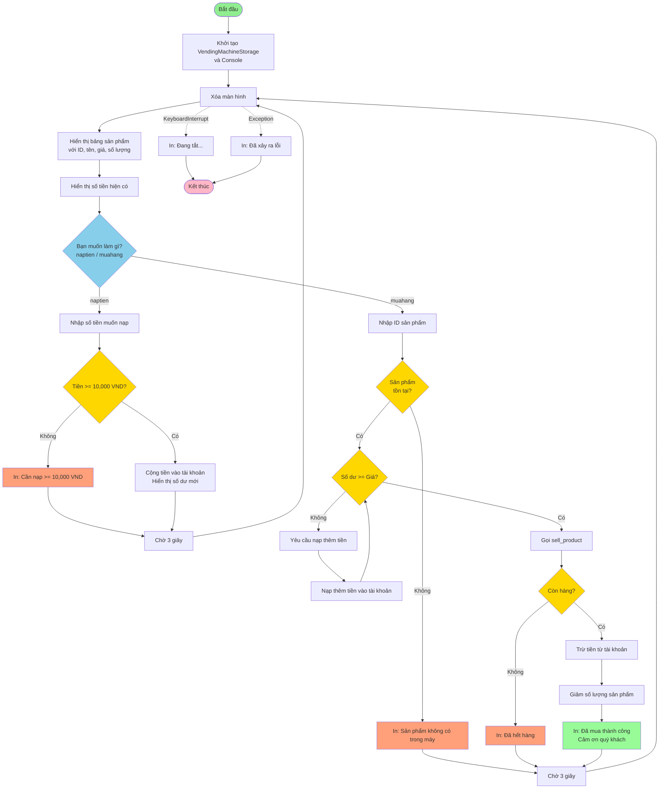

# Yêu cầu bài đến từ
[LHU elearning](https://learn.lhu.edu.vn/mod/assign/view.php?id=275403&forceview=1)

Đề tài 3: Máy Bán Hàng Quản Lý Tồn Kho 📦(Số nhóm được chọn: 1)

·         Mô tả đề tài: Đây là phiên bản nâng cao của bài toán máy bán hàng tự động. Thay vì chỉ bán hàng, chương trình còn phải quản lý số lượng tồn kho của từng sản phẩm. Thử thách của đề tài là quản lý trạng thái của nhiều đối tượng (sản phẩm) bằng các biến đơn giản và đảm bảo dữ liệu (số lượng, tiền) được cập nhật chính xác sau mỗi giao dịch.

·         Yêu cầu chi tiết:

1.      Khởi tạo ít nhất 3 sản phẩm, mỗi sản phẩm có tên, giá bán, và số lượng tồn kho ban đầu.

2.      Hiển thị menu sản phẩm cho người dùng, kèm theo giá và số lượng còn lại.

3.      Khi người dùng chọn mua một sản phẩm, chương trình phải kiểm tra đồng thời 2 điều kiện: sản phẩm có còn hàng không và người dùng có đủ tiền không.

4.      Nếu giao dịch thành công, chương trình phải: trừ tiền của người dùng, giảm số lượng tồn kho của sản phẩm đi 1, và thông báo thành công.

5.      Nếu sản phẩm đã hết hàng hoặc người dùng không đủ tiền, phải đưa ra thông báo lỗi tương ứng.

6.      Menu phải được cập nhật sau mỗi lần mua để phản ánh đúng số lượng tồn kho mới.

# Máy Bán Hàng Tự Động (Vending Machine) - Phiên bản CLI bằng Python

## Mô tả chương trình

Chương trình mô phỏng một máy bán nước tự động hoàn chỉnh chạy trên terminal với giao diện đẹp nhờ thư viện `rich`.  
Người dùng có thể nạp tiền (tối thiểu 10.000 VND), xem danh sách sản phẩm, mua hàng và nhận thông báo kết quả chi tiết.

## Yêu cầu cài đặt

```bash
pip install rich
```

Hoặc dùng file có sẵn:
- Windows: chạy `install.bat`
- Linux/macOS: chạy `install.sh`

## Cách chạy chương trình

```bash
python main.py
```

## Cách hoạt động tổng quan

1. Chương trình hiển thị bảng sản phẩm với ID, tên, giá và số lượng còn lại.
2. Người dùng chọn:
   - `naptien` → nạp tiền vào máy
   - `muahang` → mua sản phẩm theo ID
3. Khi mua hàng:
   - Nếu không đủ tiền → tự động yêu cầu nạp thêm cho đến khi đủ
   - Kiểm tra tồn kho, trừ tiền, trừ hàng và thông báo kết quả
4. Sau mỗi hành động sẽ tạm dừng 3 giây rồi làm mới màn hình.

---

## Cấu trúc mã nguồn

```
VendingMachine/
├── enums.py          → Định nghĩa các Enum trạng thái
├── storage.py        → Logic nghiệp vụ và dữ liệu
├── main.py           → Giao diện người dùng & vòng lặp chính
├── requirements.txt
├── install.bat/sh
└── readme.md
```

---

## Chi tiết các thành phần quan trọng

### 1. `enums.py` – Các trạng thái trả về

Định nghĩa 3 enum để xử lý kết quả một cách rõ ràng, an toàn kiểu dữ liệu:

```python
class NaptienStatus(enum.Enum):
    INVALID = 0          # Số tiền không hợp lệ (không phải int)
    SUCCESS = 1          # Nạp thành công
    UNDER_10K = 2        # Nạp dưới 10.000 VND

class BuyProductStatus(enum.Enum):
    NOT_ENOUGH_STOCK = 0   # Hết hàng
    NOT_ENOUGH_MONEY = 1   # Không đủ tiền
    NOT_EXISTS = 2         # ID sản phẩm không tồn tại
    SUCCESS = 3            # Mua thành công
    FAILED = 4             # Lỗi không xác định

class ProductSellStatus(enum.Enum):
    NOT_ENOUGH_STOCK = 0
    SUCCESS = 1
```

---

### 2. `storage.py` – Lớp quản lý dữ liệu và nghiệp vụ

#### Class `Product`

```python
class Product:
    def __init__(self, name, price, stock):
        self.name = name
        self.price = price
        self.stock = stock

    def sell(self) -> ProductSellStatus:
        if self.stock < 1:
            return ProductSellStatus.NOT_ENOUGH_STOCK
        self.stock -= 1
        return ProductSellStatus.SUCCESS
```

- `sell()` chỉ trừ 1 đơn vị kho và trả về trạng thái thành công hoặc hết hàng.

#### Class `VendingMachineStorage` (lớp chính)

```python
def __init__(self):
    self.products: Dict[int, Product] = { ... }  # 15 sản phẩm cố định
    self.money = 0                               # Số dư của người dùng
```

##### Hàm `nap_tien(self, money: int) -> NaptienStatus`

```python
def nap_tien(self, money: int) -> NaptienStatus:
    if not isinstance(money, int):
        return NaptienStatus.INVALID
    if money < 10_000:
        return NaptienStatus.UNDER_10K
    self.money += money
    return NaptienStatus.SUCCESS
```

- Kiểm tra kiểu dữ liệu và điều kiện tối thiểu 10.000 VND.

##### Hàm `sell_product(self, id) -> BuyProductStatus`

```python
def sell_product(self, id) -> BuyProductStatus:
    if not self.has_products(id):
        return BuyProductStatus.NOT_EXISTS
    
    product = self.get_product(id)
    if self.money < product.price:
        return BuyProductStatus.NOT_ENOUGH_MONEY
    if product.stock < 1:
        return BuyProductStatus.NOT_ENOUGH_STOCK
    
    if product.sell() == ProductSellStatus.SUCCESS:
        self.money -= product.price
        return BuyProductStatus.SUCCESS
    
    return BuyProductStatus.FAILED
```

- Đây là hàm cốt lõi thực hiện toàn bộ quy trình mua hàng một cách an toàn và trả về trạng thái chi tiết.

##### Các hàm hỗ trợ khác
- `get_balance()`, `get_product(id)`, `has_products(id)`, `get_all_products()` – chỉ lấy dữ liệu, không thay đổi trạng thái.

---

### 3. `main.py` – Giao diện và luồng điều khiển

#### Hàm `display_menu(console, vending)`

```python
def display_menu(console: Console, vending: VendingMachineStorage):
    console.clear()
    table = Table(title=f"Máy bán hàng tự động - Bạn đang có {vending.money} VND", show_lines=True)
    table.add_column("ID sản phẩm", style="cyan")
    table.add_column("Tên sản phẩm", style="red")
    table.add_column("Giá thành (VND)", style="blue")
    table.add_column("Số lượng còn lại", style="magenta")
    
    for id, item in vending.get_all_products().items():
        table.add_row(str(id), item.name, str(item.price), str(item.stock))
    console.print(table)
```

- Xóa màn hình và vẽ lại bảng sản phẩm mỗi lần.

#### Hàm `process_topup(console, vending, prompt=...)`

```python
def process_topup(console: Console, vending: VendingMachineStorage, prompt="Vui lòng nhập số tiền muốn nạp"):
    tien_nap = IntPrompt.ask(prompt, console=console)
    match vending.nap_tien(int(tien_nap)):
        case NaptienStatus.SUCCESS:
            console.print(f"Bạn đã nạp {tien_nap} VND ...", style="green")
        case NaptienStatus.UNDER_10K:
            console.print("Cần nạp số tiền lớn hơn hoặc bằng 10.000 VND", style="red")
        ...
```

- Sử dụng `match-case` để xử lý tất cả trạng thái trả về từ `nap_tien`.

#### Hàm `process_buy_product(console, vending)`

```python
def process_buy_product(console: Console, vending: VendingMachineStorage):
    id_mon_hang = IntPrompt.ask("Vui lòng chọn ID sản phẩm theo bảng phía trên", console=console)
    
    if not vending.has_products(int(id_mon_hang)):
        console.print(f"Sản phẩm với ID {id_mon_hang} không có trong máy")
        return
    
    product = vending.get_product(int(id_mon_hang))
    
    # Tự động yêu cầu nạp thêm tiền nếu thiếu (vòng lặp while)
    while vending.get_balance() < product.price:
        process_topup(console, vending, 
                     f"Vui lòng nạp thêm tiền, bạn còn thiếu {product.price - vending.money} VND để mua mặt hàng này")
    
    # Thực hiện mua
    match vending.sell_product(int(id_mon_hang)):
        case BuyProductStatus.SUCCESS:
            console.print(f"Đã mua sản phẩm {product.name} ...", style="green")
        case BuyProductStatus.NOT_ENOUGH_STOCK:
            console.print(f"Mặt hàng {product.name} đã hết hàng", style="yellow")
        ...
```

- Đặc biệt: vòng lặp `while` buộc người dùng nạp đủ tiền trước khi cho phép mua → trải nghiệm người dùng rất tốt.

#### Vòng lặp chính

```python
while True:
    display_menu(console, vending)
    selection = Prompt.ask("Bạn muốn làm gì?", choices=["naptien", "muahang"])
    
    if selection == "naptien":
        process_topup(console, vending)
    elif selection == "muahang":
        process_buy_product(console, vending)
    
    time.sleep(3)   # Đợi 3 giây để người dùng đọc thông báo
```

- Chương trình chỉ thoát khi người dùng nhấn `Ctrl+C`.

---

## Tính năng nổi bật

- Giao diện đẹp, màu sắc rõ ràng nhờ `rich`
- Kiểm tra đầy đủ các trường hợp lỗi (hết hàng, không đủ tiền, sản phẩm không tồn tại)
- Tự động yêu cầu nạp thêm tiền khi thiếu (không cần quay lại menu)
- Sử dụng `Enum` và `match-case` → code hiện đại, dễ bảo trì
- Dễ mở rộng: chỉ cần thêm sản phẩm vào `__init__` của `VendingMachineStorage`

Chúc bạn trải nghiệm vui vẻ với máy bán nước tự động ảo này!

### Flowchart của chương trình

